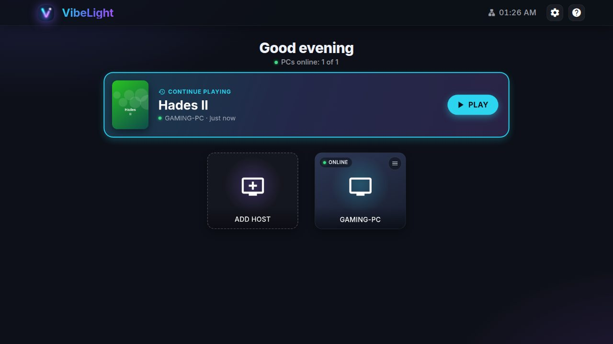
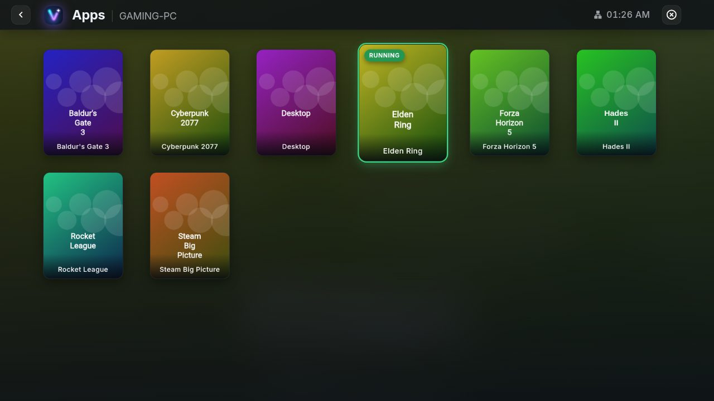
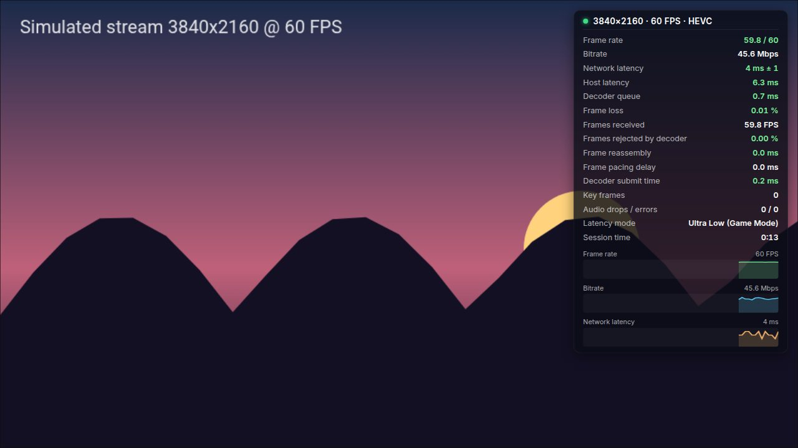
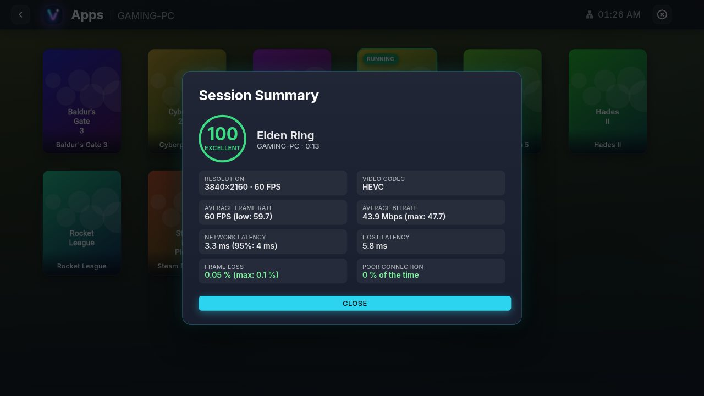
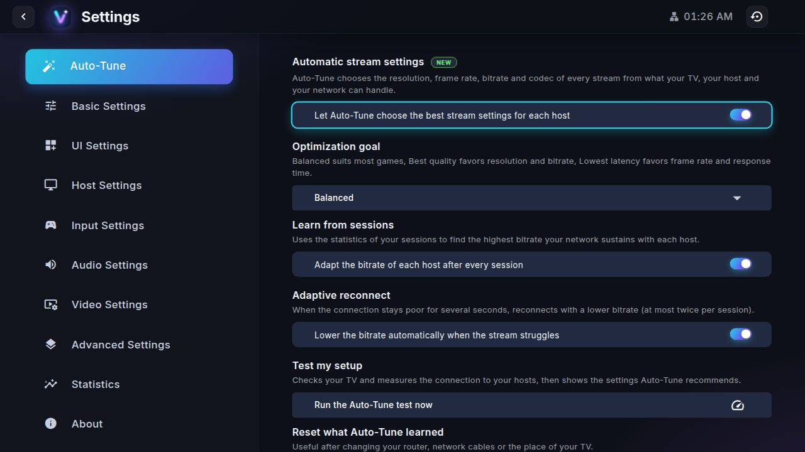
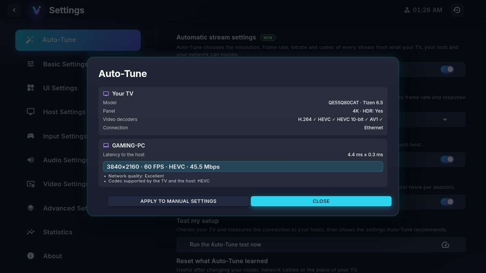
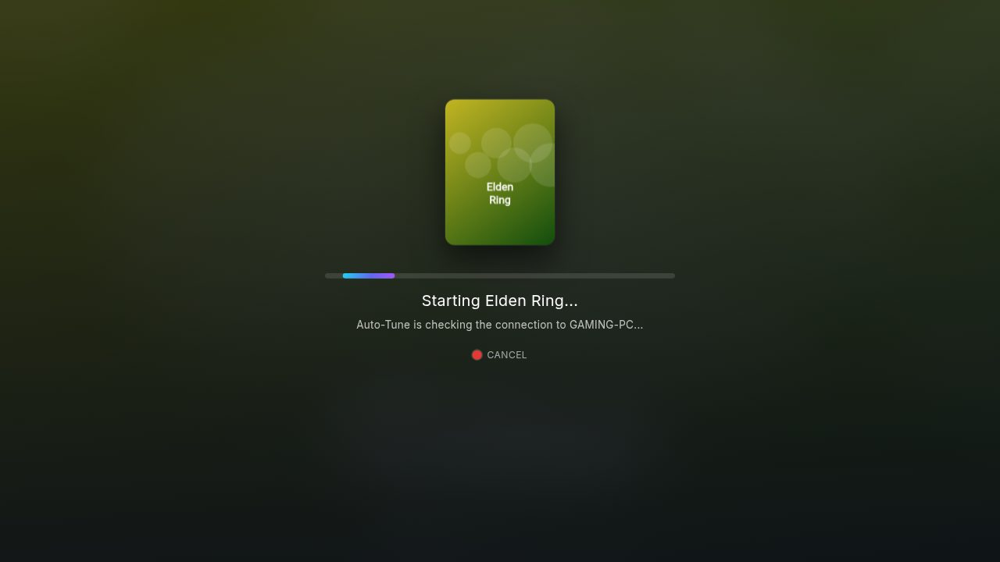
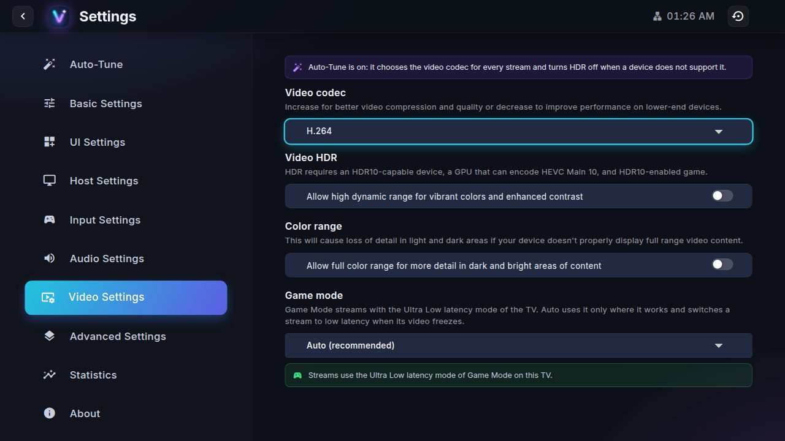

<p align="center"></p>

# VibeLight

[](https://github.com/php4vtgqd5-prog/vibelight-tizen/actions/workflows/ci.yml)
[](https://github.com/php4vtgqd5-prog/vibelight-tizen/releases)
[](LICENSE)

🇵🇱 [Polska wersja](README.pl.md)

VibeLight streams the games, apps or full desktop of your PC to a Samsung Smart TV, from
[Sunshine](https://app.lizardbyte.dev/Sunshine/) or NVIDIA GameStream. It is based on
[Moonlight Tizen](https://github.com/brightcraft/moonlight-tizen) and adds automatic stream
settings, stream statistics, a one-press way back into your last game and a redesigned interface.

## What VibeLight adds

- **Auto-Tune.** Every stream gets its resolution, frame rate, bitrate and codec from what the TV
  decodes, what the host encodes and what the network carries (Ethernet or Wi-Fi signal, latency
  measured to the host). Choose a goal: *Balanced*, *Best quality* or *Lowest latency*.
  - It learns from your sessions the bitrate each host sustains, and remembers the ones that failed.
  - When the connection stays poor, it reconnects at a lower bitrate (at most twice per session).
  - When the TV cannot open the decoder of a codec, it switches to another one by itself.
  - *Test my setup* shows the capabilities of your TV, the latency to your hosts and the settings
    it recommends, which you can copy to the manual settings.
- **Stream statistics.** An overlay with compact, standard and detailed modes (frame rate, bitrate,
  latency, frame loss, decoder queue, pacing, audio) switched with the YELLOW key, a quality score
  after each session and a history of the last sessions.
- **Continue playing.** The home screen offers the last app you streamed: press OK and VibeLight
  wakes the host if needed and starts the app. With *Resume on launch* it starts by itself after a
  short countdown, which BACK cancels.
- **A modern interface.** A dark theme with the Inter typeface and a new icon, a greeting with the
  PCs online on the home screen, an app list over the colors of the focused game, animated cards with
  clear focus, a loading screen with the box art of the app and the chosen settings, a clock in the
  header, and a Polish translation next to English and Brazilian Portuguese.
- **Stability.** Many fixes in the streaming core: teardown races, leaks, a busy-waiting frame
  pacer, gamepad input, and more (see the [changelog](CHANGELOG.md)).

## Screenshots

<table>
  <tr>
    <td width="50%"><br><sub>Home screen with the PCs online and Continue playing</sub></td>
    <td width="50%"><br><sub>Apps of a PC over the colors of the focused game</sub></td>
  </tr>
  <tr>
    <td width="50%"><br><sub>Detailed statistics overlay, switched with the YELLOW key</sub></td>
    <td width="50%"><br><sub>Quality score and summary after a session</sub></td>
  </tr>
  <tr>
    <td width="50%"><br><sub>Auto-Tune settings</sub></td>
    <td width="50%"><br><sub>Test my setup: the TV, the latency and the recommended settings</sub></td>
  </tr>
  <tr>
    <td width="50%"><br><sub>Loading screen while Auto-Tune checks the connection</sub></td>
    <td width="50%"><br><sub>Game Mode, which Auto uses only where it works</sub></td>
  </tr>
</table>

## Requirements

- **TV:** Samsung Smart TV with Tizen 5.5 or newer (2020 models onwards).
- **Host:** a PC running Sunshine (any GPU with a hardware encoder) or GeForce Experience.
- **Network:** the host on wired Ethernet, the TV on Ethernet or a good 5 GHz Wi-Fi.
- **Input:** a gamepad connected to the TV is recommended, the remote control works for the menus.

## Installation

Download `VibeLight.wgt` from the [latest release](https://github.com/php4vtgqd5-prog/vibelight-tizen/releases),
or the build of any commit from the artifacts of the [CI workflow](https://github.com/php4vtgqd5-prog/vibelight-tizen/actions/workflows/ci.yml).
VibeLight installs like Moonlight Tizen, so the
[installation guide of Moonlight Tizen](https://github.com/brightcraft/moonlight-tizen/wiki/Installation-Guide)
applies with the VibeLight file. The short version, with the Tizen CLI of the Docker image of this
repository:

1. On the TV, open *Apps*, type `12345` with the remote, turn on *Developer mode*, enter the IP
   address of your computer and restart the TV.
2. On your computer, build the image and open a shell in it:
   ```sh
   docker build -t vibelight .
   docker run -it --rm vibelight
   ```
3. In that shell, connect to the TV and install the widget built in the image:
   ```sh
   sdb connect <TV IP address>
   tizen install -n VibeLight.wgt -t $(sdb devices | awk 'NR==2 {print $3}')
   ```

TVs with Tizen 7 or newer only accept apps signed with a Samsung certificate for the TV: see the
guide above. VibeLight has its own package id, so it installs next to Moonlight; pair your hosts
again in VibeLight.

## Remote control

| Key | Action |
| --- | --- |
| OK | Select, start the app, continue playing |
| BACK | Go back, cancel the Resume on launch countdown |
| RED | Stop the stream, or cancel a stream that is still starting |
| YELLOW | Switch the statistics overlay: off, compact, standard, detailed |
| CH+ | Open the menu of a host |

*Settings → About → Navigation guide* lists the keyboard and gamepad controls.

## Game Mode

Game Mode streams with the Ultra Low latency mode of the Samsung WASM player, which skips the
picture processing of the TV. It does not work on every TV: the player of Tizen 5.5 does not have
it, and on Tizen 9 it freezes the video on its first frame or leaves it black. The *Game mode*
setting (Video settings) takes care of that:

- **Auto** (the default) uses Game Mode only where it works: not on Tizen 5.5, not on Tizen 9 and
  newer, not when the WASM player reports that it lacks the mode, and not on a TV where it froze.
- **Always on** forces it wherever the player has it, **Off** never uses it.
- A watchdog follows every Game Mode stream: when its video freezes (the player rejects the frames,
  reports decoding errors or stops its playback), VibeLight restarts the stream in the Low latency
  mode and remembers it for this TV. *Try Game Mode again on this TV* forgets it.
- After the first short Game Mode stream you stop yourself, VibeLight asks once whether the video
  froze, for freezes the watchdog cannot see.
- The detailed statistics overlay shows the latency mode of the stream.

On Tizen 9, install `VibeLight-GameMode.wgt` to get Game Mode anyway: it declares Game Mode in its
package, so the TV switches to it when VibeLight starts, while the streams use the Low latency mode.

## Development

The interface runs in a desktop browser with a simulated TV and host, see
[tools/dev-harness](tools/dev-harness/README.md). Node.js 20 or newer is required.

```sh
npm ci
npm run harness      # http://localhost:8080/
npm run check        # lint (ES2017 for Tizen 5.5), unit tests, locale files, WebAssembly syntax check
npx playwright install chromium
npm run test:ui      # UI tests in Chromium against the harness
npm run screenshots  # screenshots of this page, saved to docs/screenshots
```

The WebAssembly module and the widget are built with the Tizen SDK and the Samsung Emscripten SDK
inside Docker: `docker build -t vibelight .` produces `/home/moonlight/VibeLight.wgt` in the image
(`--build-arg FORCE_GAME_MODE=true` builds the Game Mode variant).

GitHub Actions run the checks, the UI tests and a build of the widget for every push
([ci.yml](.github/workflows/ci.yml)). To publish a version, update the version in `res/config.xml`
and `package.json`, add its section to [CHANGELOG.md](CHANGELOG.md), then push a tag such as
`v2.0.0`: [release.yml](.github/workflows/release.yml) builds both widgets and publishes the release
with its notes.

Translations live in `wasm/static/locales`; `npm run i18n:sync` adds new strings to every locale,
see [CONTRIBUTING](.github/CONTRIBUTING.md).

## Credits and license

VibeLight is based on [Moonlight Tizen](https://github.com/brightcraft/moonlight-tizen) by
brightcraft, itself based on the work of [KyroFrCode](https://github.com/KyroFrCode/moonlight-chrome-tizen),
the [Samsung Developers WASM port](https://github.com/SamsungDForum/moonlight-chrome) and
[Moonlight](https://moonlight-stream.org/). It is free software under the
[GNU General Public License v3](LICENSE).
