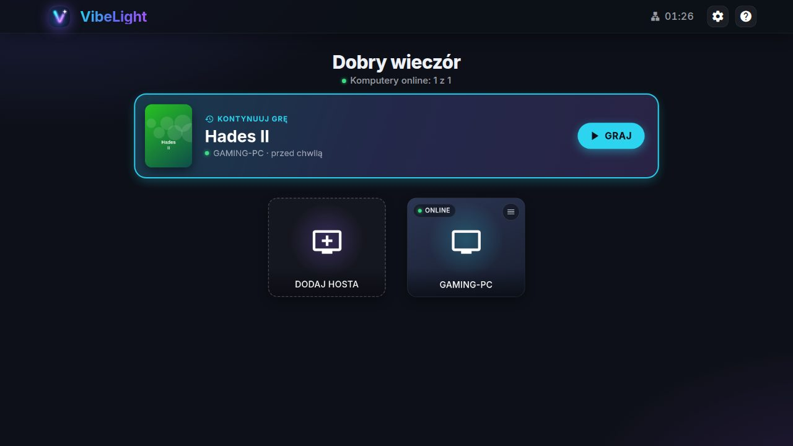
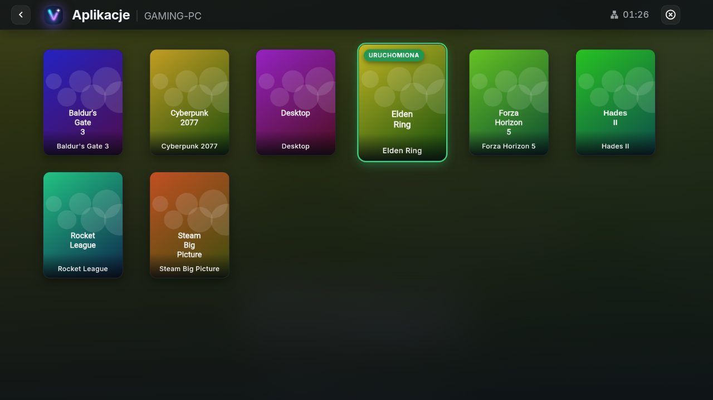
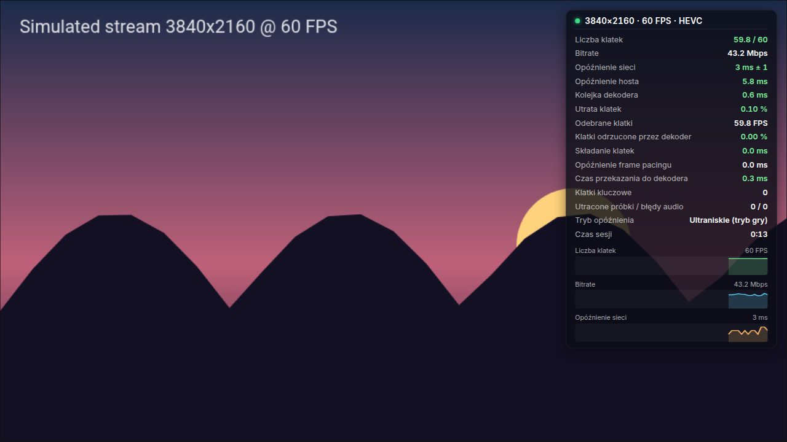
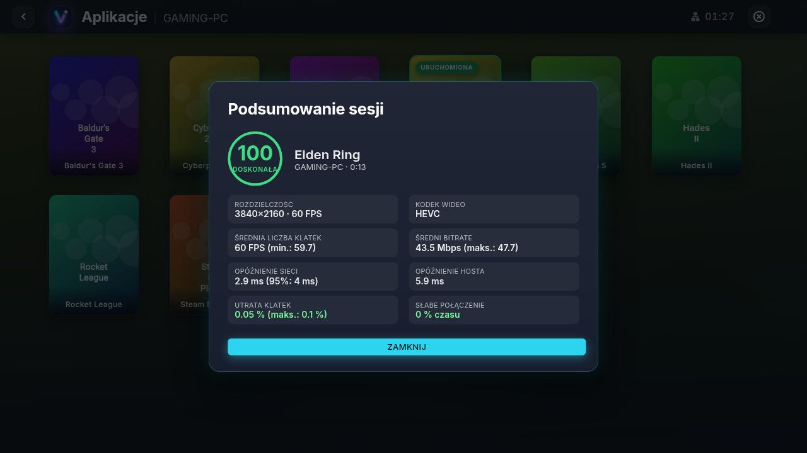
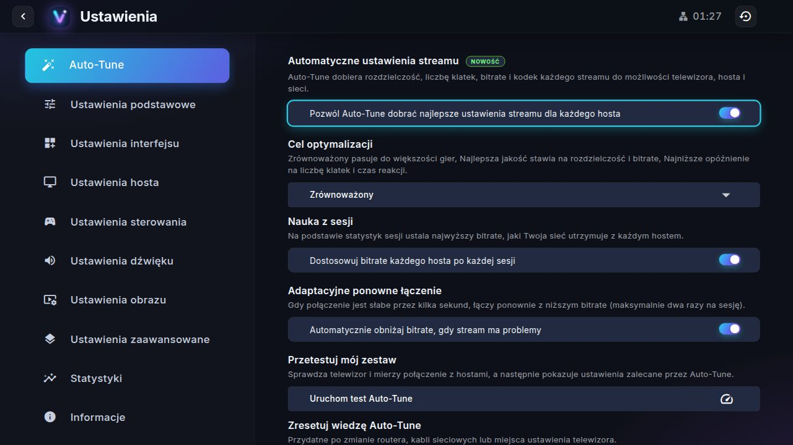
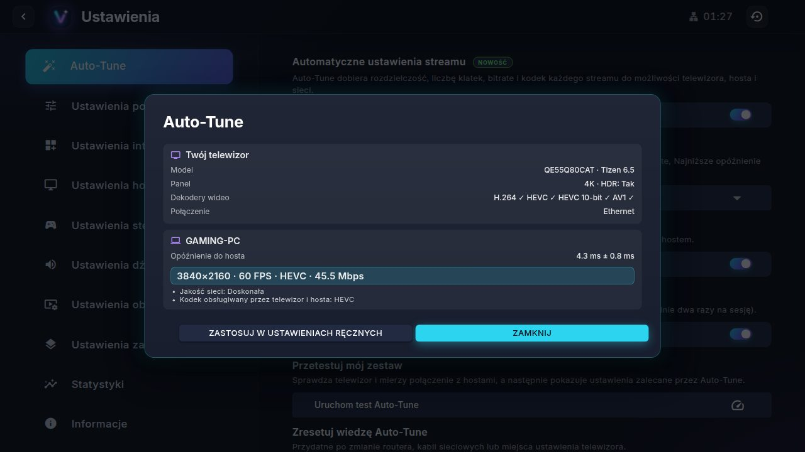
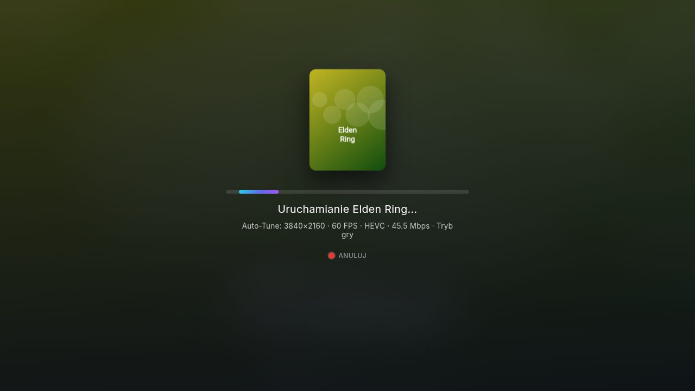
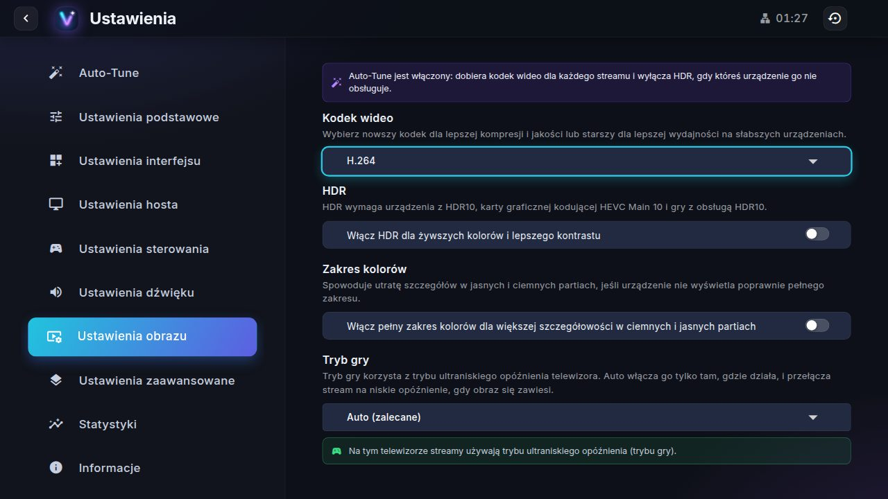

<p align="center"></p>

# VibeLight

🇬🇧 [English version](README.md)

VibeLight przesyła gry, aplikacje lub cały pulpit komputera na telewizor Samsung Smart TV, z
[Sunshine](https://app.lizardbyte.dev/Sunshine/) lub NVIDIA GameStream. Bazuje na
[Moonlight Tizen](https://github.com/brightcraft/moonlight-tizen) i dodaje automatyczne ustawienia
streamu, statystyki, powrót do ostatniej gry jednym przyciskiem oraz nowy interfejs.

## Co nowego w VibeLight

- **Auto-Tune.** Każdy stream dostaje rozdzielczość, liczbę klatek, bitrate i kodek dobrane do tego,
  co dekoduje telewizor, co koduje host i co przenosi sieć (Ethernet lub siła sygnału Wi-Fi,
  opóźnienie zmierzone do hosta). Do wyboru cel: *Zrównoważony*, *Najlepsza jakość* lub
  *Najniższe opóźnienie*.
  - Uczy się z Twoich sesji, jaki bitrate utrzymuje każdy host, i pamięta te, które zawiodły.
  - Gdy połączenie długo jest słabe, łączy ponownie z niższym bitrate (maksymalnie dwa razy na sesję).
  - Gdy telewizor nie może otworzyć dekodera danego kodeka, sam przełącza się na inny.
  - *Przetestuj mój zestaw* pokazuje możliwości telewizora, opóźnienie do hostów i zalecane
    ustawienia, które można przenieść do ustawień ręcznych.
- **Statystyki streamu.** Nakładka w trybie kompaktowym, standardowym i szczegółowym (klatki,
  bitrate, opóźnienia, utrata klatek, kolejka dekodera, frame pacing, dźwięk) przełączana ŻÓŁTYM
  przyciskiem, ocena jakości po każdej sesji i historia ostatnich sesji.
- **Kontynuuj grę.** Ekran główny proponuje ostatnio streamowaną aplikację: naciśnij OK, a VibeLight
  w razie potrzeby wybudzi hosta i uruchomi aplikację. Z opcją *Wznawianie przy uruchomieniu* startuje
  sama po krótkim odliczaniu, które anulujesz przyciskiem WSTECZ.
- **Nowoczesny interfejs.** Ciemny motyw z krojem Inter i nową ikoną, powitanie z liczbą komputerów
  online na ekranie głównym, lista aplikacji na tle w kolorach wybranej gry, animowane karty z
  wyraźnym zaznaczeniem, ekran ładowania z okładką aplikacji i wybranymi ustawieniami, zegar w
  nagłówku oraz polskie tłumaczenie obok angielskiego i portugalskiego.
- **Stabilność.** Wiele poprawek w silniku streamingu: wyścigi przy zamykaniu streamu, wycieki
  pamięci, frame pacer obciążający procesor, obsługa padów i więcej (zobacz [listę zmian](CHANGELOG.md)).

## Zrzuty ekranu

<table>
  <tr>
    <td width="50%"><br><sub>Ekran główny z komputerami online i opcją Kontynuuj grę</sub></td>
    <td width="50%"><br><sub>Aplikacje komputera na tle w kolorach wybranej gry</sub></td>
  </tr>
  <tr>
    <td width="50%"><br><sub>Szczegółowa nakładka statystyk, przełączana ŻÓŁTYM przyciskiem</sub></td>
    <td width="50%"><br><sub>Ocena jakości i podsumowanie po sesji</sub></td>
  </tr>
  <tr>
    <td width="50%"><br><sub>Ustawienia Auto-Tune</sub></td>
    <td width="50%"><br><sub>Przetestuj mój zestaw: telewizor, opóźnienie i zalecane ustawienia</sub></td>
  </tr>
  <tr>
    <td width="50%"><br><sub>Ekran ładowania, gdy Auto-Tune sprawdza połączenie</sub></td>
    <td width="50%"><br><sub>Tryb gry, który Auto włącza tylko tam, gdzie działa</sub></td>
  </tr>
</table>

## Wymagania

- **Telewizor:** Samsung Smart TV z Tizen 5.5 lub nowszym (modele od 2020 roku).
- **Host:** komputer z Sunshine (dowolna karta graficzna ze sprzętowym koderem) lub GeForce Experience.
- **Sieć:** host podłączony kablem, telewizor kablem lub przez dobre Wi-Fi 5 GHz.
- **Sterowanie:** zalecany pad podłączony do telewizora, pilot wystarcza do obsługi menu.

## Instalacja

Pobierz `VibeLight.wgt` z [najnowszego wydania](https://github.com/php4vtgqd5-prog/vibelight-tizen/releases)
albo build dowolnego commita z artefaktów [workflow CI](https://github.com/php4vtgqd5-prog/vibelight-tizen/actions/workflows/ci.yml).
VibeLight instaluje się tak samo jak Moonlight Tizen, więc
[przewodnik instalacji Moonlight Tizen](https://github.com/brightcraft/moonlight-tizen/wiki/Installation-Guide)
działa z plikiem VibeLight. W skrócie, z Tizen CLI z obrazu Docker tego repozytorium:

1. Na telewizorze otwórz *Aplikacje*, wpisz pilotem `12345`, włącz *Tryb programisty*, podaj adres IP
   komputera i uruchom telewizor ponownie.
2. Na komputerze zbuduj obraz i otwórz w nim powłokę:
   ```sh
   docker build -t vibelight .
   docker run -it --rm vibelight
   ```
3. W tej powłoce połącz się z telewizorem i zainstaluj zbudowaną aplikację:
   ```sh
   sdb connect <adres IP telewizora>
   tizen install -n VibeLight.wgt -t $(sdb devices | awk 'NR==2 {print $3}')
   ```

Telewizory z Tizen 7 lub nowszym przyjmują tylko aplikacje podpisane certyfikatem Samsunga dla
danego telewizora: szczegóły w przewodniku powyżej. VibeLight ma własny identyfikator pakietu, więc
instaluje się obok Moonlight; hosty trzeba sparować w VibeLight ponownie.

## Pilot

| Przycisk | Działanie |
| --- | --- |
| OK | Wybór, uruchomienie aplikacji, kontynuacja gry |
| WSTECZ | Powrót, anulowanie odliczania wznawiania przy uruchomieniu |
| CZERWONY | Zakończenie streamu lub anulowanie streamu, który jeszcze się uruchamia |
| ŻÓŁTY | Przełączanie nakładki statystyk: wyłączona, kompaktowa, standardowa, szczegółowa |
| KANAŁ + | Menu hosta |

*Ustawienia → Informacje → Przewodnik po sterowaniu* opisuje sterowanie klawiaturą i padem.

## Tryb gry

Tryb gry streamuje w trybie ultraniskiego opóźnienia odtwarzacza WASM Samsunga, który pomija
przetwarzanie obrazu w telewizorze. Nie działa na każdym telewizorze: odtwarzacz Tizen 5.5 go nie
ma, a na Tizen 9 zatrzymuje obraz na pierwszej klatce albo zostawia czarny ekran. Opcja *Tryb gry*
(Ustawienia obrazu) radzi sobie z tym:

- **Auto** (domyślnie) włącza tryb gry tylko tam, gdzie działa: nie na Tizen 5.5, nie na Tizen 9 i
  nowszych, nie gdy odtwarzacz WASM zgłasza brak tego trybu i nie na telewizorze, na którym obraz
  się zawiesił.
- **Zawsze włączony** wymusza go wszędzie tam, gdzie odtwarzacz go ma, **Wyłączony** nigdy go nie używa.
- Strażnik pilnuje każdego streamu w trybie gry: gdy obraz się zawiesi (odtwarzacz odrzuca klatki,
  zgłasza błędy dekodowania albo przestaje odtwarzać), VibeLight uruchamia stream ponownie w trybie
  niskiego opóźnienia i zapamiętuje to dla tego telewizora. *Spróbuj ponownie trybu gry na tym
  telewizorze* kasuje tę informację.
- Po pierwszym krótkim streamie w trybie gry, który sam zakończysz, VibeLight raz zapyta, czy obraz
  się zawiesił, na wypadek zawieszeń, których strażnik nie widzi.
- Szczegółowa nakładka statystyk pokazuje tryb opóźnienia streamu.

Na Tizen 9 zainstaluj `VibeLight-GameMode.wgt`, aby mimo to mieć tryb gry: deklaruje on tryb gry w
pakiecie, więc telewizor przełącza się w niego przy starcie VibeLight, a streamy używają trybu
niskiego opóźnienia.

## Rozwój

Interfejs działa w przeglądarce na komputerze z symulowanym telewizorem i hostem, zobacz
[tools/dev-harness](tools/dev-harness/README.md). Wymagany jest Node.js 20 lub nowszy.

```sh
npm ci
npm run harness      # http://localhost:8080/
npm run check        # lint (ES2017 dla Tizen 5.5), testy jednostkowe, pliki tłumaczeń, składnia modułu WebAssembly
npx playwright install chromium
npm run test:ui      # testy interfejsu w Chromium na symulatorze
npm run screenshots  # zrzuty ekranu tej strony, zapisywane w docs/screenshots
```

Moduł WebAssembly i aplikację buduje się narzędziami Tizen SDK i Samsung Emscripten w Dockerze:
`docker build -t vibelight .` tworzy w obrazie plik `/home/moonlight/VibeLight.wgt`
(`--build-arg FORCE_GAME_MODE=true` buduje wariant z trybem gry).

GitHub Actions uruchamia sprawdzenia, testy interfejsu i build aplikacji przy każdym pushu
([ci.yml](.github/workflows/ci.yml)). Aby wydać wersję, zmień numer wersji w `res/config.xml`
i `package.json`, dodaj jej sekcję do [CHANGELOG.md](CHANGELOG.md) i wypchnij tag, np. `v2.0.0`:
[release.yml](.github/workflows/release.yml) zbuduje oba warianty i opublikuje wydanie z opisem zmian.

Tłumaczenia są w `wasm/static/locales`; `npm run i18n:sync` dodaje nowe teksty do wszystkich języków,
zobacz [CONTRIBUTING](.github/CONTRIBUTING.md).

## Podziękowania i licencja

VibeLight bazuje na [Moonlight Tizen](https://github.com/brightcraft/moonlight-tizen) autorstwa
brightcraft, który z kolei korzysta z pracy [KyroFrCode](https://github.com/KyroFrCode/moonlight-chrome-tizen),
[portu WASM od Samsung Developers](https://github.com/SamsungDForum/moonlight-chrome) i projektu
[Moonlight](https://moonlight-stream.org/). To wolne oprogramowanie na licencji
[GNU General Public License v3](LICENSE).
